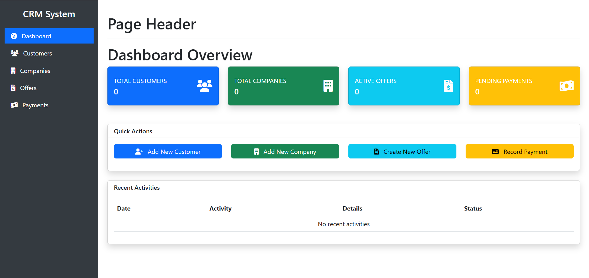

# CRM Spring Boot Application

A robust Customer Relationship Management (CRM) system built with Spring Boot by **Ayush Singh Tomar**.

---

## 📷 Screenshots

### Dashboard



---

## 🚀 Features

### 🙋 Customer Management

- Full CRUD operations for customers
- Stores:
  - Personal details: First name, Last name
  - Contact: Email, Phone
  - Address: Country, City, District
  - Notes in free-text format
- Auto-tracking of record creation and modification dates

### 🌍 Location Management

- Hierarchical data management:
  - Countries
  - Cities
  - Districts
- Easy linkage of customers to locations

### 🛒 Product and Sales Management

- Product catalog management
- Brands and categories
- Payment and offer tracking

### 📅 Meeting Status Tracking

- Track and manage customer meetings
- Monitor all customer interactions

---

## ⚙️ Technical Stack

- **Spring Boot 3.3.1**
- **PostgreSQL** (Database)
- **Spring Data JPA** + **Hibernate** (ORM)
- **Thymeleaf** (UI templating)
- **Lombok** (reduces boilerplate code)
- **OpenAPI/Swagger** (API docs)
- **RESTful API architecture**
- **JPA Auditing** (for timestamps)
- **Layered architecture** (Controller, Service, Repository)

---

## 🛠️ Setup Instructions

### 📖 Prerequisites

- Java 17+
- Maven 3.6+
- PostgreSQL 12+

### 🗃️ Database Setup

1. Install PostgreSQL (if not already installed)
2. Create a new database:

```sql
CREATE DATABASE crm;

